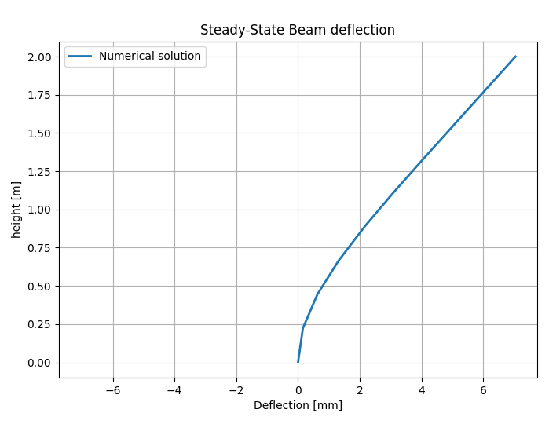
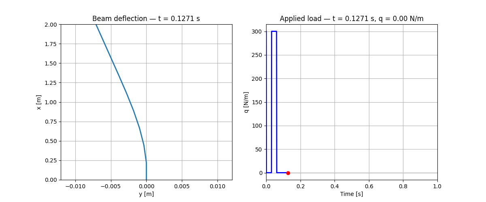

A finite-difference simulator for a single 1D beam subject to external loading (e.g., wind force).  
The program computes the deflection of a beam either in steady-state (static) or time-dependent (dynamic) form.  
It produces CSV outputs in `build/` (`beam_static_results.csv`, `beam_dynamic_results.csv`) and includes Python scripts for plotting and animation.

---

## Theory

### Static case — Euler–Bernoulli beam equation

The steady-state calculation solves the **Euler–Bernoulli beam equation** in its static form:

$$E I \frac{d^4 y}{d x^4} = q(x)$$

where:

| Symbol | Meaning |
|:--------|:---------|
| $y(x)$ | deflection of the beam (m) |
| $E$ | Young’s modulus (Pa) |
| $I$ | second moment of area (m⁴) |
| $q(x)$ | external distributed load per unit length (N/m) |

The equation is discretized using the **finite-difference method (FDM)**, leading to a **linear system of equations** with a **penta-diagonal coefficient matrix**.  
This represents the spatial coupling introduced by the fourth-order derivative.

---

### Dynamic case — damped Euler–Bernoulli beam equation

The time-dependent simulation solves the **dynamic form** of the Euler–Bernoulli beam equation, extended with **inertia** and **damping** terms:

$$
\rho A \frac{\partial^2 y}{\partial t^2} + c \frac{\partial y}{\partial t} + E I \frac{\partial^4 y}{\partial x^4} = q(x,t)
$$

where the new terms represent:

| Term | Meaning |
|:------|:----------|
| $\rho A \frac{\partial^2 y}{\partial t^2}$ | inertial force per unit length (mass × acceleration) |
| $c \frac{\partial y}{\partial t}$ | damping (energy dissipation) |

The equation is solved using an **explicit finite-difference time integration scheme (leap-frog method)**.  
Due to the explicit nature of the method, the **time step** must satisfy an approximate **stability condition**:

$$\Delta t \sim (\Delta x)^2$$

to ensure stable simulation of the beam’s oscillations.

The gravitational force is neglected in both cases.

---

### Boundary conditions

The beam is modeled as **clamped at x = 0** and **free at x = L**, leading to the following boundary conditions:

| Condition | Physical meaning |
|:-----------|:----------------|
| $y(0) = 0$ | zero position at the clamped end |
| $\frac{dy}{dx}(0) = 0$ | zero slope at the clamped end |
| $\frac{d^2y}{dx^2}(L) = 0$ | zero bending moment at the free end |
| $\frac{d^3y}{dx^3}(L) = 0$ | zero shear force at the free end |

These conditions ensure that the beam is rigidly attached at the base and free to move at its tip.

---

## Requirements
- Linux
- CMake >= 3.10
- g++ with C++17 support
- Eigen3 (development headers)
- Python 3 with: pandas, numpy, matplotlib (for visualization)

Install on Debian/Ubuntu:
```bash
sudo apt update
sudo apt install build-essential cmake libeigen3-dev python3 python3-pip
pip3 install pandas numpy matplotlib
```

## Build (CMake)
From project root:
```bash
cmake -S . -B build -DCMAKE_BUILD_TYPE=Release
cmake --build build
```
Binary: `build/BeamFDM`

For debug build:
```bash
cmake -S . -B build -DCMAKE_BUILD_TYPE=Debug
cmake --build build
```

## Run
- Run from terminal:
```bash
./build/BeamFDM
```
- In VS Code: use the configured tasks (`Run Task` → `run` or build task) or the debug configuration `Debug BeamFDM` in `.vscode/launch.json`.

## Visualization (Python)
- Static plot:
```bash
python3 plotBeam.py
```


- Dynamic animation:
```bash
python3 animateBeam.py
```


Make sure the CSV files are present in `build/`.

## Next steps
- Check and handle all possible input errors.
- Use a band solver (LAPACK `dgbsv`) for the linear system in the static simulation for better performance (≈ O(N), not O(N²)).
- Use an implicit method for the dynamic simulation to allow a larger time step ($\Delta t \sim \Delta x$ not $(\Delta x)^2$.
- Calculate other physical quantities such as velocity, acceleration, bending moment and shear force.
- Include gravitational force.
- Allow modeling a tree built from multiple branching beams.

## Contact
jansilar@post.cz